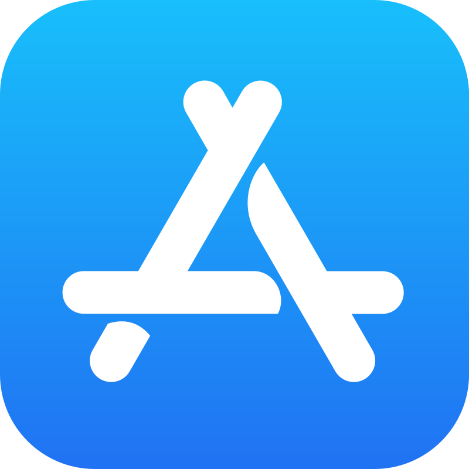

  

  
  
  

# Apple Bundle IDs

Apple's Bundle IDs for native iPhone and iPad apps. The table below lists the names and corresponding bundle IDs for each native iPhone and iPad app. Note that bundle IDs are case-sensitive.

This list is automatically rebuilt once a month, but only if changes are detected on Apple’s Bundle IDs website.

**75** apps - v1.0.3 built on Feb 14, 2026 at 04:31 | See also :point_right: [App Store Web Search](https://github.com/petarov/appstore-web-search)

| Icon | App Name | Bundle ID |
| --- | --- | --- |
|  |  App Store |  com.apple.AppStore 
|  |  ✨ App Store Connect |  com.apple.AppStoreConnect  🆕
|  |  ✨ Apple Configurator |  com.apple.ios.configurator  🆕
|  |  Apple Store |  com.apple.store.Jolly 
|  |  Apple Vision Pro |  com.apple.visionproapp 
|  |  Barcode Scanner |  com.apple.BarcodeScanner 
|  |  Books |  com.apple.iBooks 
|  |  ✨ Business Essentials |  com.apple.business-essentials  🆕
|  |  Calculator |  com.apple.calculator 
|  |  Calendar |  com.apple.mobilecal 
|  |  Camera |  com.apple.camera 
|  |  ✨ Classical |  com.apple.music.classical  🆕
|  |  ✨ Classroom |  com.apple.classroom  🆕
|  |  Clips |  com.apple.clips 
|  |  Clock |  com.apple.mobiletimer 
|  |  Compass |  com.apple.compass 
|  |  Contacts |  com.apple.MobileAddressBook 
|  |  Developer |  developer.apple.wwdc-Release 
|  |  FaceTime |  com.apple.facetime 
|  |  Files |  com.apple.DocumentsApp 
|  |  ✨ Final Cut Camera |  com.apple.FinalCutApp.companion  🆕
|  |  ✨ Final Cut Pro |  com.apple.FinalCutApp  🆕
|  |  Find My |  com.apple.findmy 
|  |  Fitness |  com.apple.Fitness 
|  |  Freeform |  com.apple.freeform 
|  |  Games |  com.apple.games 
|  |  GarageBand |  com.apple.mobilegarageband 
|  |  Health |  com.apple.Health 
|  |  Home |  com.apple.Home 
|  |  iCloud Drive |  com.apple.iCloudDriveApp 
|  |  iMovie |  com.apple.iMovie 
|  |  Invites |  com.apple.rsvp 
|  |  iTunes Store |  com.apple.MobileStore 
|  |  Journal |  com.apple.journal 
|  |  Keynote |  com.apple.Keynote 
|  |  ✨ Logic Pro |  com.apple.mobilelogic  🆕
|  |  ✨ Logic Remote |  com.apple.musicapps.remote  🆕
|  |  Magnifier |  com.apple.Magnifier 
|  |  Mail |  com.apple.mobilemail 
|  |  Maps |  com.apple.Maps 
|  |  Measure |  com.apple.measure 
|  |  Messages |  com.apple.MobileSMS 
|  |  Music |  com.apple.Music 
|  |  News |  com.apple.news 
|  |  Notes |  com.apple.mobilenotes 
|  |  Numbers |  com.apple.Numbers 
|  |  Pages |  com.apple.Pages 
|  |  Passwords |  com.apple.Passwords 
|  |  Phone |  com.apple.mobilephone 
|  |  Photo Booth |  com.apple.Photo-Booth 
|  |  ✨ Photomator |  com.pixelmatorteam.pixelmator.touch.x.photo  🆕
|  |  Photos |  com.apple.mobileslideshow 
|  |  ✨ Pixelmator Classic iOS |  com.pixelmatorteam.pixelmator.touch  🆕
|  |  Playground |  com.apple.GenerativePlaygroundApp 
|  |  Podcasts |  com.apple.podcasts 
|  |  Preview |  com.apple.Preview 
|  |  ✨ Reality Composer |  com.apple.RealityComposer  🆕
|  |  Reminders |  com.apple.reminders 
|  |  ✨ Research |  com.apple.Research  🆕
|  |  Safari |  com.apple.mobilesafari 
|  |  ✨ Schoolwork |  com.apple.schoolwork.ClassKitApp  🆕
|  |  Settings |  com.apple.Preferences 
|  |  ✨ Shazam |  com.shazam.Shazam  🆕
|  |  Shortcuts |  com.apple.shortcuts 
|  |  ✨ Sports |  com.apple.sports  🆕
|  |  Stocks |  com.apple.stocks 
|  |  Swift Playground |  com.apple.Playgrounds 
|  |  ✨ TestFlight |  com.apple.TestFlight  🆕
|  |  Tips |  com.apple.tips 
|  |  Translate |  com.apple.Translate 
|  |  TV |  com.apple.tv 
|  |  Voice Memos |  com.apple.VoiceMemos 
|  |  Wallet |  com.apple.Passbook 
|  |  Watch |  com.apple.Bridge 
|  |  Weather |  com.apple.weather 

# Installation

Install and update NPM:

    npm install github:petarov/apple-bundle-ids

Or just use the compiled `csv` and `json` files from `dist/`

# Contributing

Because the list gets auto-rebuilt  there's no need to add apps manually to it. If you find other issues, please open a [pull request](https://github.com/petarov/apple-bundle-ids/pulls).

# Building

Requires Python `3.x` and working Internet connection.

Run the following to install dependencies, build all `dist/` files and generate all `README.md` translations:

    ./make

To run the script in production mode, which means bump the `package.json` version on update and exit if no updates at Apple's website are found, run:

    ./make prod

# License

[MIT License](LICENSE)
