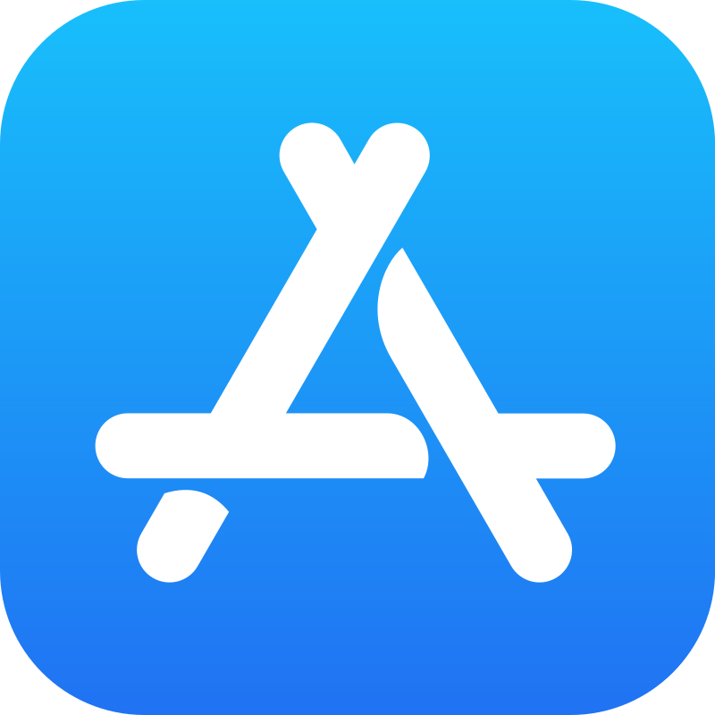

  

  
  
  

# Apple Bundle IDs

Apple's Bundle IDs for native iPhone and iPad apps. The table below lists the names and corresponding bundle IDs for each native iPhone and iPad app. Note that bundle IDs are case-sensitive.

This list is automatically rebuilt once a month, but only if changes are detected on Apple’s Bundle IDs website.

**55** apps - v1.0.1 built on Oct 14, 2025 at 04:02 | See also :point_right: [App Store Web Search](https://github.com/petarov/appstore-web-search)

| Icon | App Name | Bundle ID |
| --- | --- | --- |
|  | App Store |  com.apple.AppStore
|  | Apple Store |  com.apple.store.Jolly
|  | Clips |  com.apple.clips
|  | FaceTime |  com.apple.facetime
|  | GarageBand |  com.apple.mobilegarageband
|  | iCloud Drive |  com.apple.iCloudDriveApp
|  | Image Playground |  com.apple.GenerativePlaygroundApp
|  | iMovie |  com.apple.iMovie
|  | iTunes Store |  com.apple.MobileStore
|  | Keynote |  com.apple.Keynote
|  | News |  com.apple.news
|  | Numbers |  com.apple.Numbers
|  | Pages |  com.apple.Pages
|  | Photo Booth |  com.apple.Photo-Booth
|  | Safari |  com.apple.mobilesafari
|  | Swift Playgrounds |  com.apple.Playgrounds
|  | TV |  com.apple.tv
|  | Watch |  com.apple.Bridge
|  | インビテーション |  com.apple.rsvp
|  | ウォレット |  com.apple.Passbook
|  | カメラ |  com.apple.camera
|  | カレンダー |  com.apple.mobilecal
|  | コンパス |  com.apple.compass
|  | ジャーナル |  com.apple.journal
|  | ショートカット |  com.apple.shortcuts
|  | デベロッパ |  developer.apple.wwdc-Release
|  | バーコードスキャナ |  com.apple.BarcodeScanner
|  | パスワード |  com.apple.Passwords
|  | ヒント |  com.apple.tips
|  | ファイル |  com.apple.DocumentsApp
|  | フィットネス |  com.apple.Fitness
|  | ブック |  com.apple.iBooks
|  | フリーボード |  com.apple.freeform
|  | ヘルスケア |  com.apple.Health
|  | ボイスメモ |  com.apple.VoiceMemos
|  | ホーム |  com.apple.Home
|  | ポッドキャスト |  com.apple.podcasts
|  | マップ |  com.apple.Maps
|  | ミュージック |  com.apple.Music
|  | メール |  com.apple.mobilemail
|  | メッセージ |  com.apple.MobileSMS
|  | メモ |  com.apple.mobilenotes
|  | リマインダー |  com.apple.reminders
|  | 拡大鏡 |  com.apple.Magnifier
|  | 株価 |  com.apple.stocks
|  | 計算機 |  com.apple.calculator
|  | 計測 |  com.apple.measure
|  | 時計 |  com.apple.mobiletimer
|  | 写真 |  com.apple.mobileslideshow
|  | 設定 |  com.apple.Preferences
|  | 探す |  com.apple.findmy
|  | 天気 |  com.apple.weather
|  | 電話 |  com.apple.mobilephone
|  | 翻訳 |  com.apple.Translate
|  | 連絡先 |  com.apple.MobileAddressBook

# Installation

Install and update NPM:

    npm install github:petarov/apple-bundle-ids

Or just use the compiled `csv` and `json` files from `dist/`

# Contributing

Because the list gets auto-rebuilt  there's no need to add apps manually to it. If you find other issues, please open a [pull request](https://github.com/petarov/apple-bundle-ids/pulls).

# Building

Requires Python `3.x` and working Internet connection.

Run the following to install dependencies, build all `dist/` files and generate all `README.md` translations:

    ./make

To run the script in production mode, which means bump the `package.json` version on update and exit if no updates at Apple's website are found, run:

    ./make prod

# License

[MIT License](LICENSE)
